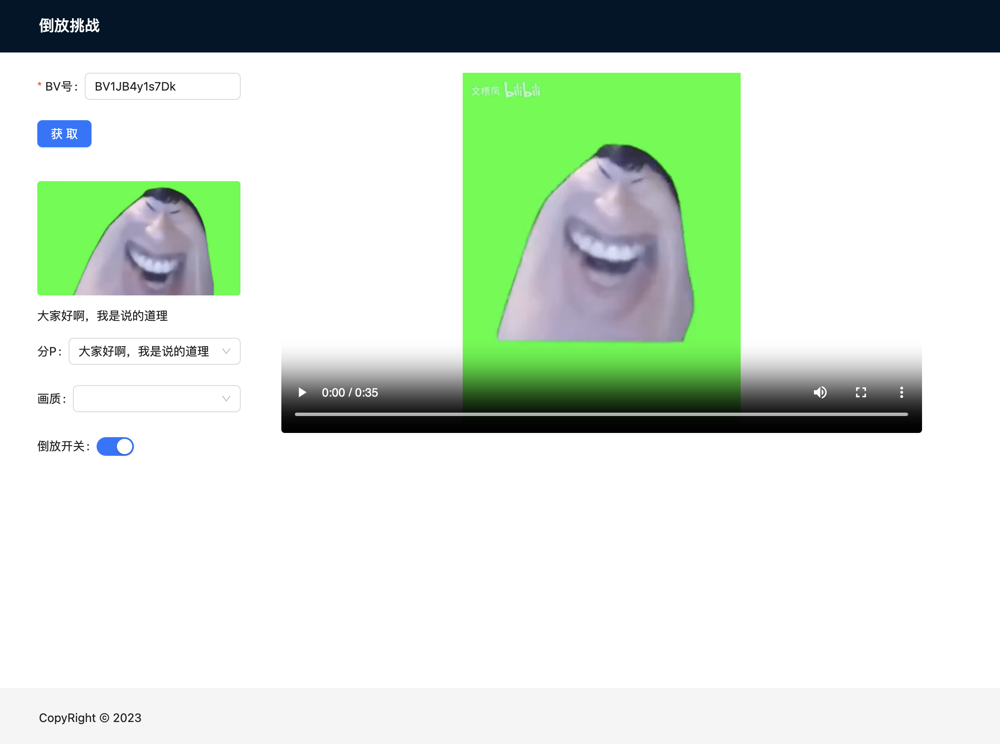

# 倒放挑战

用来听电棍鬼叫的，实践证明这玩意的确很好用。



## 技术栈

1. Next.js
2. Tailwind CSS
3. Ant Design
4. ffmpeg.wasm
5. 鬼叫能量

## 用法

```bash
gh repo clone akarachen/reverse-challenge
pnpm i
pnpm dev
open http://localhost:3000
```

输入 BV 号，自动爬信息，等 ffmpeg.wasm 跑完，就能溜了。

## 推荐曲目

BV1JB4y1s7Dk

## 种种因素

1. 叔叔家的 API 在海外请求的结果跟国内不一样，所以你不能把他部署到境外。
2. 国内实名部署这玩意属于在这人世上没在乎的人了，所以我推荐你不要部署到国内。
3. 我想把他打包成 Tauri 的桌面应用，但是他在 Safari 上炸了，所以只能 Windows Only。
4. 打 electron 太屎了，我不想干。

所以这玩意我想不出怎么用了，，，

## 鸣谢

1. [Bilibili API](https://github.com/SocialSisterYi/bilibili-API-collect)
2. [永雏塔菲](https://space.bilibili.com/1265680561/)
3. [嘉然今天吃什么](https://space.bilibili.com/672328094/)
